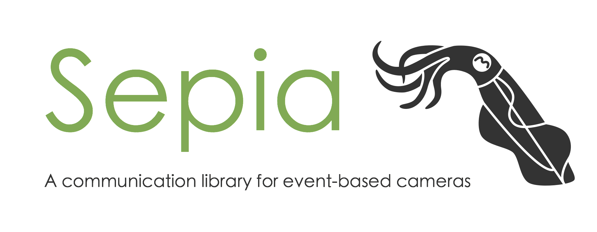

# Sepia

Sepia is a library to communicate with an event-based camera. It is an header-only library.

# Installation

## Dependencies

Sepia relies on [Premake 4.x](https://github.com/premake/premake-4.x) (x ≥ 3), which is a utility to ease the install process. Follow these steps:
  - __Debian / Ubuntu__: Open a terminal and execute the command `sudo apt-get install premake4`.
  - __Fedora__: Open a terminal and execute the command `sudo dnf install premake`. Then, run 
  `echo '/usr/local/lib' | sudo tee /etc/ld.so.conf.d/neuromorphic-paris.conf > /dev/null`.
  - __OS X__: Open a terminal and execute the command `brew install premake`. If the command is not found, you need to install Homebrew first with the command 
  `ruby -e "$(curl -fsSL https://raw.githubusercontent.com/Homebrew/install/master/install)"`.

## Install

To install the source, go to the *sepia* directory and run:
  - __Linux__: `premake4 install && sudo ldconfig`
  - __OS X__: `premake4 install`
The library files are installed in */usr/local/include*. The firmwares are installed in */usr/local/share* and the Opal Kelly Front Panel files in */usr/local/include* and */usr/local/lib*. You need to be connected to the Vision Institute local network for this step to work, as it implies downloading close-source resources.

## Uninstall

To uninstall the library, run `premake4 uninstall` from the *sepia* directory.

## Test

To test the library, run the following commands:
  - Go to the *sepia* directory and run `premake4 gmake && cd build && make`. Use `premake4 --icc gmake` instead to use the Intel c++ compiler.
  - Run the executable *Release/opalKellyAtisSepiaTest*.

# User guides and documentation

User guides and code documentation are held in the [wiki](https://github.com/neuromorphic-paris/sepia/wiki).

# License

See the [LICENSE](LICENSE.md) file for license rights and limitations (MIT).
